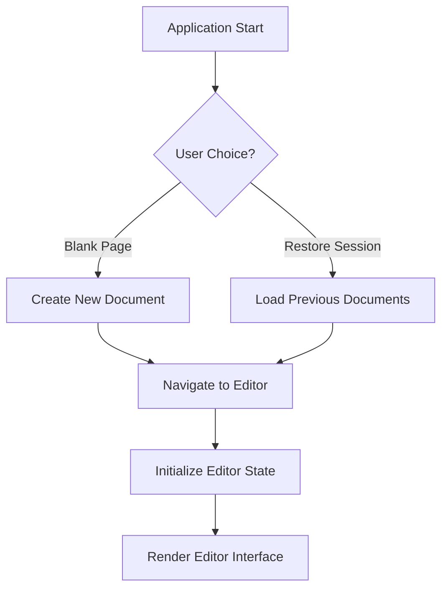

# Design Document: MarkText-Next Bug Fixes and Feature Enhancements

## Document Information

| Field | Value |
|-------|--------|
| **Project** | MarkText-Next |
| **Version** | 0.1.0 |
| **Date** | 2024-12-19 |
| **Status** | Active |

## Executive Summary

This design document provides detailed architectural and UI/UX specifications for the MarkText-Next bug fixes and feature enhancements. It covers the startup navigation fix, dual-screen mode improvements, real-time synchronization, export functionality, and code cleanup requirements.

## Architecture Overview

### System Architecture

```
┌─────────────────────────────────────────────────────────────┐
│                    MarkText-Next Application                 │
├─────────────────────────────────────────────────────────────┤
│  ┌─────────────────────────────────────────────────────────┐ │
│  │              Vue 3 Application Layer                    │ │
│  ├─────────────────────────────────────────────────────────┤ │
│  │  ┌─────────────┐  ┌─────────────┐  ┌─────────────┐     │ │
│  │  │  Startup    │  │   Editor    │  │   Export    │     │ │
│  │  │ Navigation  │  │ Components  │  │ Services    │     │ │
│  │  └─────────────┘  └─────────────┘  └─────────────┘     │ │
│  └─────────────────────────────────────────────────────────┘ │
├─────────────────────────────────────────────────────────────┤
│  ┌─────────────────────────────────────────────────────────┐ │
│  │             Electron Main Process                       │ │
│  └─────────────────────────────────────────────────────────┘ │
├─────────────────────────────────────────────────────────────┤
│  ┌─────────────────────────────────────────────────────────┐ │
│  │               Node.js Runtime                           │ │
│  └─────────────────────────────────────────────────────────┘ │
└─────────────────────────────────────────────────────────────┘
```

### Component Architecture

```
src/renderer/src/
├── components/
│   ├── startup/
│   │   ├── StartupPage.vue          # 启动页面组件
│   │   └── NavigationFix.vue        # 导航修复逻辑
│   ├── editorWithTabs/
│   │   ├── DualScreenMode.vue       # 双屏模式主组件
│   │   ├── SourcePanel.vue          # 源码面板
│   │   └── PreviewPanel.vue         # 预览面板
│   └── export/
│       ├── ExportDialog.vue         # 导出对话框
│       ├── ConfluencePreview.vue    # Confluence预览
│       └── WeChatPreview.vue        # 微信预览
├── services/
│   ├── syncService.js               # 同步服务
│   ├── exportService.js             # 导出服务
│   └── cleanupService.js            # 清理服务
└── utils/
    ├── formatConverters.js          # 格式转换工具
    └── startupNavigation.js         # 启动导航工具
```

## Detailed Design Specifications

### 1. Startup Navigation Fix Design

#### Problem Analysis
The current startup flow gets stuck on the "New File" page due to improper routing logic and state management issues.

#### Solution Architecture



#### Component Design

```vue
<!-- src/renderer/src/components/startup/StartupPage.vue -->
<template>
  <div class="startup-page">
    <div class="options">
      <button @click="handleBlankPage" class="option-btn">
        Open Blank Page
      </button>
      <button @click="handleRestoreSession" class="option-btn">
        Restore Previous Session
      </button>
    </div>
  </div>
</template>

<script setup>
import { useRouter } from 'vue-router'
import { useEditorStore } from '@/store/editor'

const router = useRouter()
const editorStore = useEditorStore()

const handleBlankPage = async () => {
  try {
    // Create new blank document
    await editorStore.createNewDocument()
    // Navigate to editor
    await router.push('/editor')
  } catch (error) {
    console.error('Failed to create blank page:', error)
  }
}

const handleRestoreSession = async () => {
  try {
    // Load previous session
    await editorStore.restoreSession()
    // Navigate to editor
    await router.push('/editor')
  } catch (error) {
    console.error('Failed to restore session:', error)
  }
}
</script>
```

#### State Management Updates

```javascript
// src/renderer/src/store/editor.js
export const useEditorStore = defineStore('editor', {
  state: () => ({
    currentDocument: null,
    sessionDocuments: [],
    startupComplete: false
  }),

  actions: {
    async createNewDocument() {
      // Create and set new document
      this.currentDocument = createBlankDocument()
      this.startupComplete = true
    },

    async restoreSession() {
      // Load and set previous documents
      this.sessionDocuments = await loadSessionDocuments()
      this.currentDocument = this.sessionDocuments[0] || createBlankDocument()
      this.startupComplete = true
    }
  }
})
```

### 2. Dual-Screen Mode Design

#### Layout Architecture

```css
/* Full-width dual-screen layout */
.dual-screen-container {
  display: flex;
  width: 100vw;
  height: 100vh;
  margin: 0;
  padding: 0;
  border: none;
  overflow: hidden;
}

.dual-screen-container.with-sidebar {
  width: calc(100vw - 300px); /* Adjust for sidebar */
}

.source-panel,
.preview-panel {
  flex: 1;
  height: 100%;
  overflow: hidden;
  border: none;
  border-right: 1px solid var(--border-color, transparent);
}

.source-panel {
  /* Source code editor styling */
}

.preview-panel {
  /* Live preview styling */
  background: var(--preview-bg, #ffffff);
  padding: 20px;
  overflow-y: auto;
}

/* Minimal button design */
.dual-screen-controls {
  position: absolute;
  top: 10px;
  right: 10px;
  z-index: 1000;
}

.control-btn {
  background: rgba(255, 255, 255, 0.9);
  border: 1px solid #e0e0e0;
  border-radius: 4px;
  padding: 6px 12px;
  font-size: 12px;
  color: #666;
  cursor: pointer;
  transition: all 0.2s ease;
}

.control-btn:hover {
  background: #f5f5f5;
  border-color: #ccc;
}
```

#### Component Structure

```vue
<!-- src/renderer/src/components/editorWithTabs/DualScreenMode.vue -->
<template>
  <div class="dual-screen-container" :class="{ 'with-sidebar': hasSidebar }">
    <!-- Source Panel -->
    <div class="source-panel">
      <SourcePanel
        v-model="sourceContent"
        @input="handleSourceInput"
      />
    </div>

    <!-- Preview Panel -->
    <div class="preview-panel">
      <PreviewPanel
        :content="previewContent"
        @edit="handlePreviewEdit"
      />
    </div>

    <!-- Minimal Controls -->
    <div class="dual-screen-controls">
      <button @click="toggleSidebar" class="control-btn">
        Toggle Sidebar
      </button>
    </div>
  </div>
</template>

<script setup>
import { ref, computed, watch } from 'vue'
import SourcePanel from './SourcePanel.vue'
import PreviewPanel from './PreviewPanel.vue'
import { useSyncService } from '@/services/syncService'

const sourceContent = ref('')
const previewContent = ref('')
const hasSidebar = ref(false)

const syncService = useSyncService()

// Real-time synchronization
watch(sourceContent, (newContent) => {
  syncService.syncToPreview(newContent)
})

const handleSourceInput = (content) => {
  sourceContent.value = content
}

const handlePreviewEdit = (content) => {
  sourceContent.value = content
  previewContent.value = content
}

const toggleSidebar = () => {
  hasSidebar.value = !hasSidebar.value
}
</script>
```

### 3. Real-Time Synchronization Design

#### Synchronization Architecture

```javascript
// src/renderer/src/services/syncService.js
class SyncService {
  constructor() {
    this.debounceTimer = null
    this.lastSyncTime = 0
    this.markdownParser = new MarkdownParser()
    this.htmlParser = new HtmlParser()
  }

  // Source to Preview (with debouncing)
  syncToPreview(markdown) {
    clearTimeout(this.debounceTimer)
    this.debounceTimer = setTimeout(async () => {
      try {
        const html = await this.markdownParser.parse(markdown)
        this.updatePreview(html)
        this.lastSyncTime = Date.now()
      } catch (error) {
        console.error('Sync to preview failed:', error)
      }
    }, 50) // 50ms debounce
  }

  // Preview to Source
  syncToSource(html) {
    try {
      const markdown = this.htmlParser.parse(html)
      this.updateSource(markdown)
    } catch (error) {
      console.error('Sync to source failed:', error)
    }
  }

  // Bidirectional sync with conflict resolution
  syncBidirectional(source, preview) {
    const sourceTime = this.getLastEditTime(source)
    const previewTime = this.getLastEditTime(preview)

    if (sourceTime > previewTime) {
      this.syncToPreview(source)
    } else if (previewTime > sourceTime) {
      this.syncToSource(preview)
    }
  }
}
```

#### Performance Optimizations

```javascript
// Virtual scrolling for large documents
const VirtualScroll = {
  init(container, content) {
    // Implement virtual scrolling logic
    // Only render visible content portions
  },

  updateScroll(position) {
    // Update visible content based on scroll position
  }
}

// Content chunking for large documents
const ContentChunker = {
  chunkSize: 1000, // characters

  split(content) {
    // Split large content into manageable chunks
    return content.match(new RegExp(`.{1,${this.chunkSize}}`, 'g')) || []
  },

  processChunk(chunk) {
    // Process individual chunks asynchronously
    return this.markdownParser.parse(chunk)
  }
}
```

### 4. Export Functionality Design

#### Export Service Architecture

```javascript
// src/renderer/src/services/exportService.js
class ExportService {
  constructor() {
    this.confluenceConverter = new ConfluenceConverter()
    this.wechatConverter = new WeChatConverter()
    this.previewRenderer = new PreviewRenderer()
  }

  // Confluence export
  async exportToConfluence(markdown, options = {}) {
    try {
      const confluenceMarkup = await this.confluenceConverter.convert(markdown, options)
      await this.copyToClipboard(confluenceMarkup)
      return {
        success: true,
        content: confluenceMarkup,
        format: 'confluence'
      }
    } catch (error) {
      throw new Error(`Confluence export failed: ${error.message}`)
    }
  }

  // WeChat export
  async exportToWeChat(markdown, format = 'web') {
    try {
      const html = await this.wechatConverter.convert(markdown, { format })
      await this.copyToClipboard(html)
      return {
        success: true,
        content: html,
        format: 'wechat',
        displayFormat: format
      }
    } catch (error) {
      throw new Error(`WeChat export failed: ${error.message}`)
    }
  }

  // Preview generation
  async generatePreview(markdown, platform, format = 'web') {
    const content = platform === 'confluence'
      ? await this.confluenceConverter.convert(markdown)
      : await this.wechatConverter.convert(markdown, { format })

    return this.previewRenderer.render(content, platform, format)
  }

  // Clipboard integration
  async copyToClipboard(content) {
    try {
      await navigator.clipboard.writeText(content)
    } catch (error) {
      // Fallback for older browsers
      const textArea = document.createElement('textarea')
      textArea.value = content
      document.body.appendChild(textArea)
      textArea.select()
      document.execCommand('copy')
      document.body.removeChild(textArea)
    }
  }
}
```

#### Export Dialog Component

```vue
<!-- src/renderer/src/components/export/ExportDialog.vue -->
<template>
  <Teleport to="body">
    <div class="export-modal-overlay" @click="closeModal">
      <div class="export-modal" @click.stop>
        <!-- Header -->
        <div class="modal-header">
          <h3>{{ platform === 'confluence' ? 'Export to Confluence' : 'Export to WeChat' }}</h3>
          <button @click="closeModal" class="close-btn">×</button>
        </div>

        <!-- Format Toggle (WeChat only) -->
        <div v-if="platform === 'wechat'" class="format-toggle">
          <button
            @click="currentFormat = 'web'"
            :class="{ active: currentFormat === 'web' }"
          >
            Web View
          </button>
          <button
            @click="currentFormat = 'mobile'"
            :class="{ active: currentFormat === 'mobile' }"
          >
            Mobile View
          </button>
        </div>

        <!-- Preview Area -->
        <div class="preview-container">
          <div class="preview-content" :class="previewClass">
            <div v-html="previewContent"></div>
          </div>
        </div>

        <!-- Actions -->
        <div class="modal-actions">
          <button @click="copyToClipboard" class="primary-btn">
            Copy to Clipboard
          </button>
          <button @click="closeModal" class="secondary-btn">
            Close
          </button>
        </div>
      </div>
    </div>
  </Teleport>
</template>

<script setup>
import { ref, computed, watch } from 'vue'
import { useExportService } from '@/services/exportService'

const props = defineProps({
  platform: {
    type: String,
    required: true,
    validator: (value) => ['confluence', 'wechat'].includes(value)
  },
  markdown: {
    type: String,
    required: true
  }
})

const emit = defineEmits(['close'])

const exportService = useExportService()
const currentFormat = ref('web')
const previewContent = ref('')

// Computed properties
const previewClass = computed(() => {
  return props.platform === 'wechat' ? `wechat-${currentFormat.value}` : 'confluence'
})

// Watch for format changes
watch([() => props.markdown, currentFormat], async () => {
  try {
    previewContent.value = await exportService.generatePreview(
      props.markdown,
      props.platform,
      currentFormat.value
    )
  } catch (error) {
    console.error('Preview generation failed:', error)
  }
}, { immediate: true })

// Actions
const copyToClipboard = async () => {
  try {
    if (props.platform === 'confluence') {
      await exportService.exportToConfluence(props.markdown)
    } else {
      await exportService.exportToWeChat(props.markdown, currentFormat.value)
    }
    // Show success message
    alert('Content copied to clipboard!')
  } catch (error) {
    alert('Export failed: ' + error.message)
  }
}

const closeModal = () => {
  emit('close')
}
</script>
```

### 5. Code Cleanup Design

#### Cleanup Strategy

```javascript
// src/renderer/src/services/cleanupService.js
class CleanupService {
  constructor() {
    this.preservedFiles = [
      'src/renderer/src/services/weChatImageUploader.js',
      'src/renderer/src/services/weChatService.js',
      'src/renderer/src/prefComponents/image/components/uploader/services.js'
    ]
  }

  // Analyze files to remove
  async analyzeCleanup() {
    const filesToRemove = []
    const filesToCheck = []

    // Find Confluence config files
    const confluenceFiles = await this.findFiles('*confluence*config*')
    filesToRemove.push(...confluenceFiles.filter(f => !this.isEssential(f)))

    // Find WeChat config files (excluding image uploader)
    const wechatFiles = await this.findFiles('*wechat*config*')
    filesToRemove.push(...wechatFiles.filter(f => !this.isImageUploaderRelated(f)))

    return { filesToRemove, filesToCheck }
  }

  // Safe removal with backup
  async safeRemove(files) {
    for (const file of files) {
      await this.backupFile(file)
      await this.removeFile(file)
      await this.updateImports(file)
    }
  }

  // Update import statements
  async updateImports(removedFile) {
    // Find files that import the removed file
    const importingFiles = await this.findImportingFiles(removedFile)

    for (const file of importingFiles) {
      await this.removeImportStatement(file, removedFile)
    }
  }
}
```

#### File Preservation Rules

```javascript
// Essential files to preserve
const ESSENTIAL_FILES = [
  // WeChat Image Uploader (KEEP)
  'src/renderer/src/services/weChatImageUploader.js',
  'src/renderer/src/services/weChatService.js',
  'src/renderer/src/prefComponents/image/components/uploader/services.js',

  // Core functionality (KEEP)
  'src/renderer/src/services/exportService.js',
  'src/renderer/src/components/export/ExportDialog.vue',
  'src/renderer/src/components/export/ConfluencePreview.vue',
  'src/renderer/src/components/export/WeChatPreview.vue'
]

// Files to remove
const FILES_TO_REMOVE = [
  // Redundant configurations
  'src/renderer/src/components/settings/WeChatConfig.vue',
  'src/renderer/src/components/settings/ExportConfig.vue',
  'src/renderer/src/store/modules/weChatConfig.js',
  'src/renderer/src/store/modules/exportConfig.js'
]
```

## UI/UX Design Specifications

### Visual Design

#### Color Scheme
```css
/* Dual-screen mode colors */
:root {
  --dual-screen-bg: #ffffff;
  --source-panel-bg: #f8f9fa;
  --preview-panel-bg: #ffffff;
  --panel-border: rgba(0, 0, 0, 0.1);
  --control-btn-bg: rgba(255, 255, 255, 0.9);
  --control-btn-hover: #f5f5f5;
}
```

#### Typography
```css
/* Consistent typography across panels */
.dual-screen-container {
  font-family: -apple-system, BlinkMacSystemFont, 'Segoe UI', Roboto, sans-serif;
  font-size: 14px;
  line-height: 1.5;
}

.source-panel {
  font-family: 'Monaco', 'Menlo', 'Ubuntu Mono', monospace;
  font-size: 13px;
}

.preview-panel {
  font-family: -apple-system, BlinkMacSystemFont, 'Segoe UI', Roboto, sans-serif;
  font-size: 16px;
}
```

### Interaction Design

#### Synchronization Indicators
```vue
<!-- Real-time sync status indicator -->
<template>
  <div class="sync-indicator" :class="syncStatus">
    <div class="sync-dot"></div>
    <span class="sync-text">{{ syncMessage }}</span>
  </div>
</template>

<style scoped>
.sync-indicator {
  position: absolute;
  bottom: 10px;
  right: 10px;
  display: flex;
  align-items: center;
  gap: 8px;
  padding: 6px 12px;
  border-radius: 4px;
  font-size: 12px;
}

.sync-indicator.syncing {
  background: #e3f2fd;
  color: #1976d2;
}

.sync-indicator.synced {
  background: #e8f5e8;
  color: #388e3c;
}

.sync-indicator.error {
  background: #ffebee;
  color: #d32f2f;
}

.sync-dot {
  width: 8px;
  height: 8px;
  border-radius: 50%;
  background: currentColor;
  animation: pulse 2s infinite;
}

@keyframes pulse {
  0%, 100% { opacity: 1; }
  50% { opacity: 0.5; }
}
</style>
```

## Performance Design

### Synchronization Performance

#### Debouncing Strategy
```javascript
const DEBOUNCE_CONFIG = {
  sourceToPreview: 50,  // ms
  previewToSource: 100, // ms
  exportPreview: 200    // ms
}

class PerformanceOptimizer {
  static debounce(func, wait) {
    let timeout
    return function executedFunction(...args) {
      const later = () => {
        clearTimeout(timeout)
        func(...args)
      }
      clearTimeout(timeout)
      timeout = setTimeout(later, wait)
    }
  }

  static throttle(func, limit) {
    let inThrottle
    return function() {
      const args = arguments
      const context = this
      if (!inThrottle) {
        func.apply(context, args)
        inThrottle = true
        setTimeout(() => inThrottle = false, limit)
      }
    }
  }
}
```

#### Memory Management
```javascript
class MemoryManager {
  static cleanupUnusedContent() {
    // Clear cached content for inactive tabs
    // Free up memory for large documents
  }

  static optimizeLargeDocuments(content) {
    // Implement virtual scrolling
    // Lazy load content portions
    // Compress cached data
  }
}
```

## Error Handling Design

### Synchronization Error Handling
```javascript
class SyncErrorHandler {
  static handleSyncError(error, context) {
    console.error(`Sync error in ${context}:`, error)

    // Show user-friendly error message
    this.showErrorNotification(error.message)

    // Attempt recovery
    if (this.canRecover(error)) {
      this.attemptRecovery(context)
    }
  }

  static showErrorNotification(message) {
    // Show toast notification
    // Don't interrupt user workflow
  }

  static canRecover(error) {
    // Determine if error is recoverable
    return error.type === 'network' || error.type === 'parsing'
  }

  static attemptRecovery(context) {
    // Retry synchronization
    // Reset to last known good state
  }
}
```

### Export Error Handling
```javascript
class ExportErrorHandler {
  static handleExportError(error, platform) {
    const userMessage = this.getUserFriendlyMessage(error, platform)
    this.showErrorDialog(userMessage)

    // Log technical details
    console.error(`Export error for ${platform}:`, error)
  }

  static getUserFriendlyMessage(error, platform) {
    switch (error.type) {
      case 'network':
        return `Network error while exporting to ${platform}. Please check your connection.`
      case 'format':
        return `Unable to convert content for ${platform} format.`
      case 'clipboard':
        return 'Failed to copy to clipboard. Please try again.'
      default:
        return `Export to ${platform} failed. Please try again.`
    }
  }
}
```

## Testing Strategy

### Unit Testing
```javascript
// src/test/services/syncService.test.js
describe('SyncService', () => {
  test('should sync source to preview with debouncing', async () => {
    // Test debounced synchronization
  })

  test('should handle bidirectional sync conflicts', async () => {
    // Test conflict resolution
  })
})
```

### Integration Testing
```javascript
// src/test/components/DualScreenMode.test.js
describe('DualScreenMode', () => {
  test('should render source and preview panels', () => {
    // Test layout rendering
  })

  test('should sync content between panels', () => {
    // Test real-time synchronization
  })
})
```

### E2E Testing
```javascript
// cypress/integration/export.feature.spec.js
describe('Export Functionality', () => {
  it('should export to Confluence with preview', () => {
    // Test complete export workflow
  })

  it('should export to WeChat with format toggle', () => {
    // Test WeChat export with different formats
  })
})
```

## Conclusion

This design document provides a comprehensive architectural specification for all the bug fixes and feature enhancements required for MarkText-Next 0.1.0. The design emphasizes:

1. **Clean Architecture**: Modular, maintainable component structure
2. **Performance Optimization**: Efficient synchronization and rendering
3. **User Experience**: Intuitive interfaces and real-time feedback
4. **Error Resilience**: Robust error handling and recovery mechanisms
5. **Testability**: Comprehensive testing strategy for all components

The implementation follows Vue 3 best practices, maintains backward compatibility, and ensures a smooth user experience across all new features.
